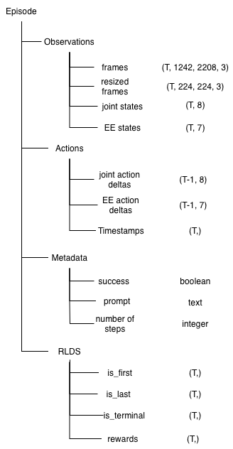

# Cable Routing with OpenVLA

Fine-tuning [OpenVLA](https://github.com/openvla/openvla) for robotic cable placement tasks using a **Lite6 robot arm** and **ZED camera**.

## Project Goal

Fine-tune a Vision-Language Action (VLA) model to manipulate a robot arm to **place cables in Y-shaped brackets** using visual observations and natural language instructions.

## System Architecture

### Hardware
- **Robot Arm**: Lite6 (UFACTORY)
- **Camera**: ZED 2i (RGB-D stereo)
- **Gripper**: Lite6 integrated gripper

### Software Stack
- **Model**: OpenVLA (7B parameter vision-language action model)
- **Framework**: Hugging Face Transformers + PyTorch
- **Data Format**: HDF5 with RLDS (Reinforcement Learning Dataset Standard)

## Data Collection Format

The dataset is collected and stored in HDF5 format following the structure below:



**Dataset Structure**:
- **Observations**: Resized RGB frames (224×224×3), joint states (8D), end-effector states (7D)
- **Actions**: Joint action deltas (8D), end-effector action deltas (7D), timestamps
- **Metadata**: Task success indicator, language prompt, number of steps
- **RLDS**: Reinforcement learning dataset standard fields (is_first, is_last, is_terminal, rewards)

## Project Structure

```
├── stream.py              # Data collection pipeline (ZED camera + robot recording)
├── api_server.py          # FastAPI server for model inference
├── api_client.py          # Client for sending requests to API
├── vla_test.py            # Local inference testing
├── openvla_utils/         # OpenVLA utilities
│   ├── finetune.py        # Fine-tuning script
│   ├── transforms.py      # Data augmentation
    ├── mixtures.py        # Weighting dataset mixtures (for fine-tuning on multiple tasks)
│   └── configs.py         # Configuration management
├── utils/                 # Helper utilities
│   ├── detector.py        # AprilTag-based bracket detection
│   ├── zed_camera.py      # Camera interface
│   ├── planner.py         # Motion planning
│   ├── record.py          # Data recording & HDF5 saving
│   └── vis_utils.py       # Visualization tools
├── my_robot_dataset/      # Custom dataset builder for Hugging Face
├── demonstrations/        # Directory for collected video demonstrations  
├── episodes/              # Directory for raw dataset episode recordings
└── media/                 # Documentation media
    ├── data_collection.png    # HDF5 format diagram
    └── episode_0102.hdf5      # Sample episode data
```

## Workflow

### 1. Data Collection
```bash
python stream.py --tag-ids 8 --fps 5
```
- Records synchronized RGB frames, joint states, and end-effector states
- Saves to HDF5 format with RLDS standard structure
- Generates demonstration videos

**Example Demonstrations:**

| Demonstration | Expected Behavior |
|:---:|:---:|
|  |  |

### 2. Fine-tuning OpenVLA
- Load the collated episodes to Google Drive in zip format
- Do this on Google Colab Pro. Use the notebook [here](openvla_colab.ipynb)
- Upload the `mixtures.py`, `configs.py`, `transforms.py` and `finetune.py` scripts along with `my_robot_dataset` directory to Colab notebook
- Run the entire notebook.
- For more information on fine-tuning, refer [this guide](MODIFICATIONS.md).

### 3. Inference
**API Server**
Launch the API server on GPU instance on Cloud. Ensure it has a minimum of 25GB vRAM.  
Load the [shell script](utils/startup.sh) there and run it.
```bash
python api_server.py
```
Then use the [client](api_client.py) to stream robot state and receive VLA output.
For more information on inference, refer [this guide](MODIFICATIONS.md).  
   
| Model Inference |
|:---:|
| |

#### Current Limitations & Multi-Perspective Solution

The model achieves accurate approach trajectories but **fails to successfully place cables into brackets** during evaluation. The root cause is a **critical camera view obstruction**: as the robot's end-effector lowers to insert the cable into the bracket groove, the primary camera view (mounted above) becomes obstructed by the robot arm itself. Consequently, the model never observes the actual cable placement action and fails to learn the fine-grained insertion dynamics required for task completion.

**The Challenge:**
- Primary perspective: Obstructed during the critical insertion phase
- Model learns accurate approach but has no visual feedback for the lowering/insertion step
- Evaluation success rate: 0% (cable not inserted into bracket for 25 test cases)

**The Solution:**
To address this limitation, augment the training data with **multi-perspective observations**:
- **Primary Perspective**: RGB view from the main overhead camera (approach phase)
- **Secondary Perspective**: RGB view from an alternate angle (side or angled view to capture insertion)
- **POV Perspective**: End-effector mounted camera or close-up view (gripper-level view of cable positioning)

By fine-tuning the model with observations from multiple synchronized viewpoints, the VLA can learn:
1. What the end-effector and cable look like during insertion
2. The correct gripper positioning and lowering trajectory
3. How to complete the insertion phase when the primary view is obstructed

This multi-modal approach enables the model to develop robust representations that compensate for single-view limitations and achieve high success rates on cable placement tasks.


## References

- **OpenVLA**: [openvla/openvla on HF Hub](https://github.com/openvla/openvla)
- **Lite6 Docs**: [UFACTORY Lite6 Manual](https://github.com/xarm-developer/xarm-python-sdk)
- **ZED Camera**: [Stereolabs ZED Documentation](https://www.stereolabs.com/docs/)
